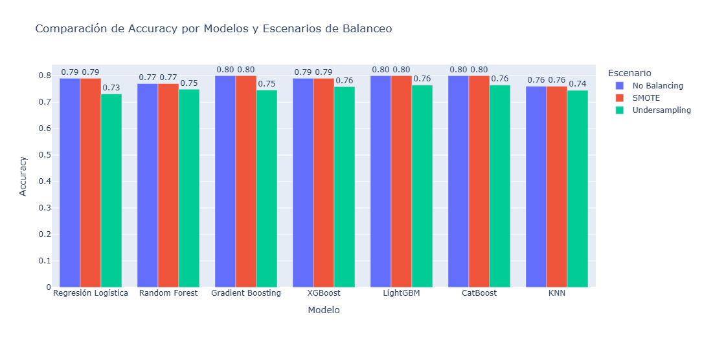
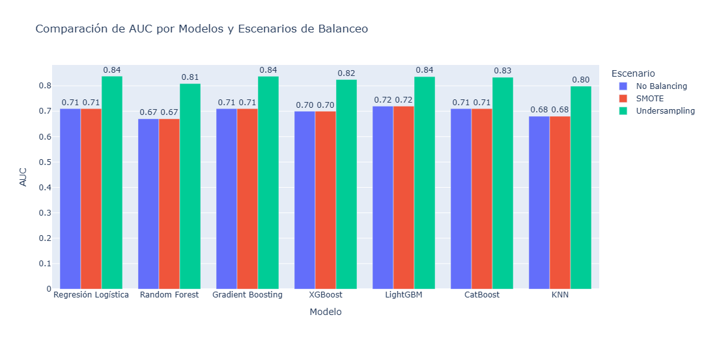
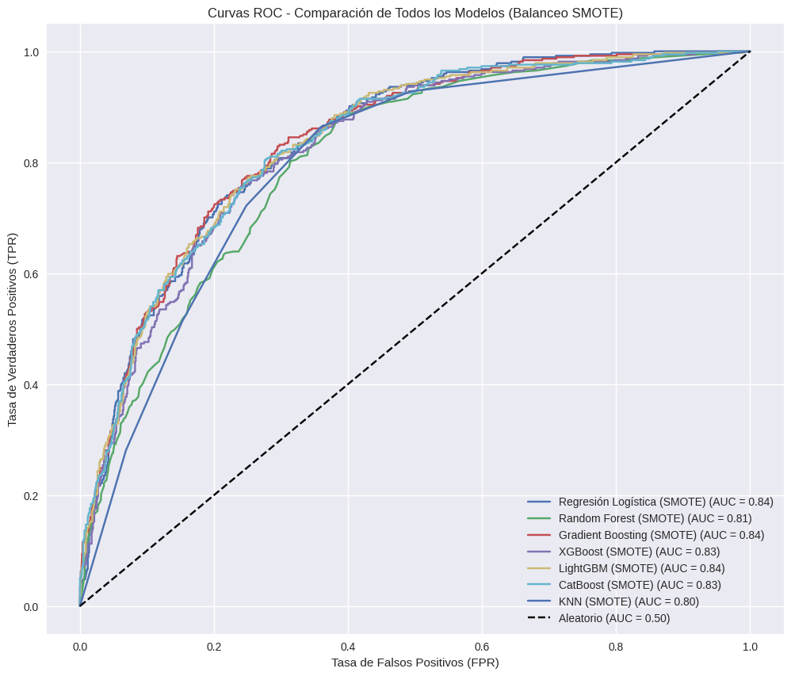
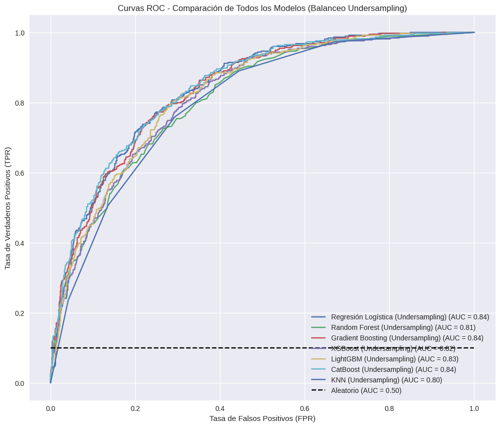
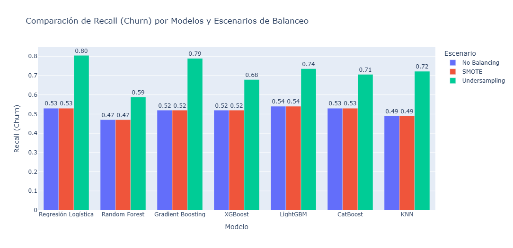

# 📊 Informe Final – ChurnInsight (Telco Customer Churn)

## 🌐 Proyecto

- **Nombre:** ChurnInsight — Predicción de Cancelación de Clientes
- **Dominio:** Telecomunicaciones / Servicios por Suscripción
- **Equipo:** Equipo 46 – Hackathon ONE / NoCountry


Empresa: Teleco
- Problema: Alta tasa de cancelación de clientes (churn)
- Objetivo del proyecto: Analizar el comportamiento de clientes para identificar patrones asociados a la cancelación del servicio (churn), como base para entrenar un modelo predictivo capaz de prever qué clientes tienen mayor probabilidad churn.

- La empresa quiere anticiparse al problema de la cancelación, respondiendo preguntas como:

1. ¿Quienes son los clientes con mayor riesgo de evasión?
2. ¿Qué variables influyen más en este comportamiento?
3. ¿Qué perfil de cliente debemos cuidar con mayor atención?

Este conocimiento es necesario para ayudar a implemenar acciones de retención y estrategias personalizadas

---

## 🚀 1. Resumen Ejecutivo

El presente informe documenta el tratamiento realizado a los datos hasta llegar al modelo y propuesta de estrategias por rangos de probabilidad del proyecto **ChurnInsight**. El modelo se dispone en un archivo pkl para consumo mediante microservicio.

A partir del dataset **Telco Customer Churn**, se realizó un proceso completo de:

* Análisis exploratorio de datos (EDA)
* Selección y justificación de variables
* Feature engineering
* Entrenamiento y evaluación de modelos
* Construcción de un pipeline reproducible
* Serialización del modelo para integración con Backend
* Estrategias propuestas de retención de cliente

El resultado final es un **modelo funcional**, interpretable y listo para ser consumido por un microservicio. Y un cuadro de Estrategias Propuestas por rangos de probabilidades.

---

## 🧠 2. Objetivo del Proyecto

* Identificar clientes con **alto riesgo de cancelación**.
* Retornar una **predicción binaria** (cancela / no cancela) junto con una **probabilidad asociada**.
* Facilitar la toma de decisiones mediante **estrategias de retención basadas en rangos de riesgo**.

---

## 📂 3. Dataset Utilizado

* **Fuente:** Kaggle – Telco Customer Churn
* **Registros:** ~7.000 clientes
* **Variable objetivo:** `Churn` (Yes / No)
* **Tipo de variables:** numéricas, binarias y categóricas

Variables clave incluyen:

* Antigüedad del cliente (`tenure`)
* Cargos mensuales (`MonthlyCharges`)
* Tipo de contrato (`Contract`)
* Método de pago (`PaymentMethod`)
* Servicios adicionales (`TechSupport`, `OnlineSecurity`, etc.)

---

## 🔍 4. Análisis Exploratorio de Datos (EDA)

👉 [Ver Dasboard EDA](https://lookerstudio.google.com/embed/reporting/731adedd-8ee2-48d0-9566-bae83407fd58/page/FgvlF)

Durante el EDA se identificaron patrones claros asociados al churn:

* Clientes con **contrato mes a mes** , driver más crítico presentan la mayor tasa de cancelación. Tasa de churn alta (42.71%).
* **Menor antigüedad (tenure bajo)** está fuertemente asociada al churn. (media de 18 meses vs. 37.6 meses para los que no cancelan)
* **Cargos mensuales altos** incrementan la probabilidad de cancelación.
* Servicios como **TechSupport y OnlineSecurity** reducen significativamente el churn.
* Variables como `gender` o servicios de streaming mostraron **bajo impacto predictivo**.

Este análisis permitió **descartar variables sin valor predictivo** y reducir ruido en el modelo.

**Segmento de Mayor Riesgo**: Clientes nuevos, con contrato mensual, factura alta, sin soporte ni seguridad, que pagan con cheque electrónico.

---

## 🧩 5. Selección Final de Variables

| Variable        | Tipo       | Uso | Justificación                      |
| --------------- | ---------- | --- | ---------------------------------- |
| tenure          | Numérica   | ✅   | Relación inversa fuerte con churn  |
| MonthlyCharges  | Numérica   | ✅   | Cargos altos aumentan churn        |
| SeniorCitizen   | Binaria    | ✅   | Impacto moderado                   |
| Contract        | Categórica | ✅   | Month-to-month concentra churn     |
| InternetService | Categórica | ✅   | Fibra óptica con mayor cancelación |
| PaymentMethod   | Categórica | ✅   | Electronic check asociado a churn  |
| TechSupport     | Categórica | ✅   | Reduce churn                       |
| OnlineSecurity  | Categórica | ⚠️  | Impacto secundario                 |
| TotalCharges    | Numérica   | ⚠️  | Resume relación cliente-empresa    |
| customerID      | ID         | ❌   | No aporta información predictiva   |

---

## 🛠️ 6. Feature Engineering y Pipeline

Se construyó un **pipeline completo** utilizando `scikit-learn`, asegurando reproducibilidad y correcta integración con Backend:

* **Variables numéricas:** escaladas con `StandardScaler`
* **Variables binarias:** mapeadas a 0 / 1
* **Variables categóricas:** transformadas con `OneHotEncoder`

Todo el preprocesamiento y el modelo se integraron mediante un **ColumnTransformer + Pipeline**, evitando fugas de información.

---

## 🤖 7. Modelado y Evaluación

Se validaron los modelos Regresión Logística , Random Forest , Gradient Boosting , XGBoost , LightGBM , CatBoost , KNN. Sin balanceo, luego con balanceo usando SMOTE y por ultimo Balanceo con Undersampling.


## Cuadro Comparativo Detallado de Métricas por Modelo (sin Balanceo)

|  Métrica              | Regresión Logística | Random Forest | Gradient Boosting | XGBoost | LightGBM | CatBoost | KNN   |
|:----------------------|:--------------------|:--------------|:------------------|:--------|:---------|:---------|:------|
| Accuracy              | 0.79                | 0.77          | **0.8**           | 0.79    | **0.8**  | 0.8      | 0.76  |
| AUC                   | **0.71**            | 0.67          | **0.71**          | 0.7     | **0.72** | **0.71** | 0.68  |
| Precision (No Churn)  | **0.84**            | 0.82          | **0.84**          | **0.84**| **0.84** | **0.84** | 0.82  |
| Recall (No Churn)     | **0.89**            | 0.88          | **0.9**           | 0.88    | **0.89** | **0.9**  | 0.86  |
| F1-Score (No Churn)   | **0.86**            | **0.85**      | **0.87**          | 0.86    | 0.87     | 0.87     | 0.84  |
| Support (No Churn)    | 1035                | 1035          | 1035              | 1035    | 1035     | 1035     | 1035  |
| Precision (Churn)     | 0.63                | 0.59          | **0.66**          | 0.61    | 0.64     | 0.65     | 0.56  |
| Recall (Churn)        | 0.53                | 0.47          | 0.52              | 0.52    | **0.54** | 0.53     | 0.49  |
| F1-Score (Churn)      | 0.58                | 0.52          | **0.59**          | 0.56    | **0.59** | 0.58     | 0.52  |
| Support (Churn)       | 374                 | 374           | 374               | 374     | 374      | 374      | 374   |


El rendimiento de los modelos evaluados sin SMOTE muestra que, si bien la precisión general es relativamente alta (alrededor del 76% al 80%), los modelos luchan consistentemente con la predicción de la clase minoritaria 'Churn'. Gradient Boosting, LightGBM y CatBoost generalmente exhiben un rendimiento ligeramente mejor en métricas clave como AUC y F1-Score para la clase 'Churn' en comparación con otros modelos.

## Cuadro ComparativoDetallado de Métricas por Modelo (Balanceo con SMOTE)


| Métrica                 | Regresión Logística | Random Forest | Gradient Boosting | XGBoost | LightGBM | CatBoost | KNN |
|:------------------------|:--------------------|:--------------|:------------------|:--------|:---------|:---------|:----|
| Accuracy                | 0.73                | 0.75          | 0.75              | 0.76    | **0.76** | **0.76** | 0.74|
| AUC                     | **0.84**            | 0.81          | **0.84**          | 0.82    | **0.84** | 0.83     | 0.80|
| Precision (No Churn)    | 0.91                | 0.85          | **0.91**          | 0.87    | 0.89     | 0.88     | 0.88|
| Recall (No Churn)       | 0.70                | 0.80          | 0.73              | 0.79    | 0.77     | **0.79** | 0.75|
| F1-Score (No Churn)     | 0.79                | 0.83          | 0.81              | **0.83**| **0.83** | **0.83** | 0.81|
| Precision (Churn)       | 0.50                | 0.53          | 0.51              | **0.54**| **0.54** | **0.54** | 0.51|
| Recall (Churn)          | **0.80**            | 0.61          | **0.79**          | 0.68    | 0.74     | 0.71     | 0.72|
| F1-Score (Churn)        | 0.61                | 0.57          | **0.62**          | 0.60    | **0.62** | 0.61     | 0.60|
| Support (No Churn)      | 1035                | 1035          | 1035              | 1035    | 1035     | 1035     | 1035|
| Support (Churn)         | 374                 | 374           | 374               | 374     | 374      | 374      | 374 |

Tras el balanceo, observamos una redistribución en las métricas, donde el Recall para 'Churn' generalmente mejora, aunque a veces a expensas de una ligera disminución en la Precision para 'No Churn' o el Accuracy general.

resumen del rendimiento de cada modelo, enfocándonos en las métricas clave para la clase 'Churn' (Precision, Recall, F1-Score) y la capacidad general de discriminación (AUC).

Observaciones Clave:

Recall (Churn) - Detección de Falsos Negativos: La Regresión Logística (SMOTE) (0.80) y Gradient Boosting (SMOTE) (0.79) destacan con los valores de Recall más altos para la clase 'Churn'. Esto significa que son los modelos más efectivos en identificar a la mayoría de los clientes que realmente abandonarán el servicio, lo cual es crucial en problemas de churn para permitir intervenciones proactivas.

Precision (Churn) - Minimización de Falsos Positivos: XGBoost (SMOTE), LightGBM (SMOTE), y CatBoost (SMOTE) muestran la mejor Precision para la clase 'Churn' (0.54). Una mayor precisión es importante para asegurar que los recursos de retención no se malgasten en clientes que el modelo predice que se irán, pero que en realidad no lo harán.

F1-Score (Churn) - Balance entre Precision y Recall: LightGBM (SMOTE) y Gradient Boosting (SMOTE) lideran con el F1-Score más alto (0.62), indicando un buen equilibrio entre Precision y Recall para la clase 'Churn'. La Regresión Logística (SMOTE) también tiene un F1-Score competitivo (0.61).

AUC - Capacidad Discriminatoria General: La Regresión Logística (SMOTE), Gradient Boosting (SMOTE) y LightGBM (SMOTE) comparten los valores de AUC más altos (0.84), lo que sugiere que son los mejores en distinguir entre las clases 'Churn' y 'No Churn' en general.

Accuracy General: LightGBM (SMOTE), CatBoost (SMOTE) y XGBoost (SMOTE) obtienen las mayores puntuaciones de Accuracy (0.76), seguidos de cerca por Random Forest (SMOTE) y Gradient Boosting (SMOTE) (0.75). Sin embargo, en un contexto de desbalance, esta métrica es menos prioritaria que las específicas de la clase minoritaria.

Conclusión General
La elección del modelo final dependerá en gran medida de la prioridad de negocio:

Si el objetivo principal es detectar a la mayor cantidad posible de clientes en riesgo (priorizando el Recall para 'Churn'), la Regresión Logística (SMOTE) o Gradient Boosting (SMOTE) serían las mejores opciones.
Si se busca un equilibrio sólido entre la detección y la fiabilidad de las predicciones (priorizando el F1-Score y una Precision aceptable para 'Churn'), LightGBM (SMOTE) y Gradient Boosting (SMOTE) se presentan como los modelos más robustos.

## Resumen de la tabla comparativa de modelos con SMOTE

### Impacto del Balanceo de Clases con SMOTE
La aplicación de SMOTE ha tenido un impacto notable en el rendimiento de los modelos, especialmente en su capacidad para identificar la clase minoritaria ('Churn'). Antes de SMOTE, los modelos tendían a mostrar una alta precisión general (Accuracy) pero un Recall más bajo para la clase 'Churn', lo que se debía al desbalance de clases. Tras el balanceo, observamos una redistribución en las métricas, donde el Recall para 'Churn' generalmente mejora, aunque a veces a expensas de una ligera disminución en la Precision para 'No Churn' o el Accuracy general.

### Análisis del Rendimiento de Cada Modelo (con SMOTE)

A continuación, se presenta un resumen del rendimiento de cada modelo, enfocándonos en las métricas clave para la clase 'Churn' (Precision, Recall, F1-Score) y la capacidad general de discriminación (AUC).

**Observaciones Clave:**

*   **Recall (Churn) - Detección de Falsos Negativos:** La **Regresión Logística (SMOTE)** (0.80) y **Gradient Boosting (SMOTE)** (0.79) destacan con los valores de Recall más altos para la clase 'Churn'. Esto significa que son los modelos más efectivos en identificar a la mayoría de los clientes que realmente abandonarán el servicio, lo cual es crucial en problemas de churn para permitir intervenciones proactivas.

*   **Precision (Churn) - Minimización de Falsos Positivos:** **XGBoost (SMOTE), LightGBM (SMOTE), y CatBoost (SMOTE)** muestran la mejor Precision para la clase 'Churn' (0.54). Una mayor precisión es importante para asegurar que los recursos de retención no se malgasten en clientes que el modelo predice que se irán, pero que en realidad no lo harán.

*   **F1-Score (Churn) - Balance entre Precision y Recall:** **LightGBM (SMOTE)** y **Gradient Boosting (SMOTE)** lideran con el F1-Score más alto (0.62), indicando un buen equilibrio entre Precision y Recall para la clase 'Churn'. La Regresión Logística (SMOTE) también tiene un F1-Score competitivo (0.61).

*   **AUC - Capacidad Discriminatoria General:** La **Regresión Logística (SMOTE), Gradient Boosting (SMOTE) y LightGBM (SMOTE)** comparten los valores de AUC más altos (0.84), lo que sugiere que son los mejores en distinguir entre las clases 'Churn' y 'No Churn' en general.

*   **Accuracy General:** **LightGBM (SMOTE), CatBoost (SMOTE)** y **XGBoost (SMOTE)** obtienen las mayores puntuaciones de Accuracy (0.76), seguidos de cerca por Random Forest (SMOTE) y Gradient Boosting (SMOTE) (0.75). Sin embargo, en un contexto de desbalance, esta métrica es menos prioritaria que las específicas de la clase minoritaria.

### Conclusión General
La elección del modelo final dependerá en gran medida de la prioridad de negocio:

*   Si el objetivo principal es **detectar a la mayor cantidad posible de clientes en riesgo** (priorizando el **Recall** para 'Churn'), la **Regresión Logística (SMOTE)** o **Gradient Boosting (SMOTE)** serían las mejores opciones.
*   Si se busca un **equilibrio sólido entre la detección y la fiabilidad de las predicciones** (priorizando el **F1-Score** y una Precision aceptable para 'Churn'), **LightGBM (SMOTE)** y **Gradient Boosting (SMOTE)** se presentan como los modelos más robustos.

SMOTE ha demostrado ser una herramienta efectiva para mejorar la detección de la clase minoritaria, haciendo que los modelos sean más útiles para las estrategias de retención de clientes.

El modelo seleccionado es **Gradient Boosting**, el objetivo es **detectar a la mayor cantidad posible de clientes en riesgo** (priorizando el **Recall** para 'Churn') y se busca tam bién un **equilibrio sólido entre la detección y la fiabilidad de las predicciones** (priorizando el **F1-Score** y una Precision aceptable para 'Churn')

## Cuadro Comparativo Detallado de Métricas por Modelo (Balanceo Undersampling)

| Métrica                 | Regresión Logística | Random Forest | Gradient Boosting | XGBoost | LightGBM | CatBoost | KNN |
|:------------------------|:--------------------|:--------------|:------------------|:--------|:---------|:---------|:----|
| Accuracy                | 0.74                | 0.74          | 0.73              | 0.73    | **0.76** | 0.74     | 0.72|
| AUC                     | **0.84**            | 0.81          | **0.84**          | 0.82    | **0.84** | **0.84** | 0.80|
| Precision (No Churn)    | **0.91**            | 0.87          | **0.91**          | 0.88    | 0.89     | 0.90     | 0.89|
| Recall (No Churn)       | 0.70                | **0.75**      | 0.71              | 0.73    | **0.77** | 0.72     | 0.71|
| F1-Score (No Churn)     | 0.79                | 0.81          | 0.80              | 0.80    | **0.83** | 0.80     | 0.79|
| Precision (Churn)       | 0.50                | 0.50          | 0.50              | 0.50    | **0.54** | 0.51     | 0.48|
| Recall (Churn)          | **0.80**            | 0.70          | **0.80**          | 0.73    | 0.74     | 0.79     | 0.76|
| F1-Score (Churn)        | **0.61**            | 0.59          | **0.61**          | 0.59    | **0.62** | **0.62** | 0.59|
| Support (No Churn)      | 1035                | 1035          | 1035              | 1035    | 1035     | 1035     | 1035|
| Support (Churn)         | 374                 | 374           | 374               | 374     | 374      | 374      | 374 |


## Resumen: Hallazgos Clave del Análisis de Datos

*   **Rendimiento General (Accuracy y AUC)**: LightGBM logró la mayor precisión (Accuracy) con 0.76. Los modelos de Regresión Logística, Gradient Boosting, LightGBM y CatBoost compartieron el AUC más alto de 0.84, lo que indica un fuerte poder discriminatorio general para estos modelos.
*   **Rendimiento de la Clase No Churn**: LightGBM mostró el mejor rendimiento para la clase "No Churn", con el Recall más alto (0.77) y el F1-Score (0.83). Regresión Logística y Gradient Boosting tuvieron la precisión más alta para "No Churn" con 0.91.
*   **Rendimiento de la Clase Churn**: Regresión Logística y Gradient Boosting lograron el Recall más alto para la clase "Churn" (0.80). LightGBM y CatBoost compartieron el F1-Score más alto para la clase "Churn" (0.62).
*   **Precisión para la Clase Churn**: Todos los modelos mostraron una precisión relativamente baja para la clase "Churn", siendo LightGBM el más alto con 0.54, seguido de CatBoost con 0.51. Esto sugiere un desafío común entre los modelos para minimizar los falsos positivos al predecir el churn.
*   **Modelo de Bajo Rendimiento**: El modelo K-Nearest Neighbors (KNN) generalmente tuvo un rendimiento inferior en la mayoría de las métricas en comparación con los otros modelos.

### Insights o Próximos Pasos

*   LightGBM y CatBoost demuestran un fuerte equilibrio de rendimiento en varias métricas para el escenario de submuestreo, lo que los convierte en candidatos prometedores para una mayor optimización o selección como modelo principal.
*   La precisión consistentemente baja para la clase "Churn" en todos los modelos destaca un área de mejora. Los esfuerzos futuros deben centrarse en estrategias para mejorar la capacidad del modelo para identificar correctamente a los churners sin una alta tasa de falsos positivos, potencialmente a través de ingeniería de características más avanzada, ajuste de umbrales o explorando diferentes técnicas de aprendizaje sensibles al costo.

### Identificación del Mejor Modelo para Clientes con Churn

Ambas técnicas de balanceo, SMOTE y Undersampling, son altamente efectivas para mejorar el poder discriminatorio de los modelos en la predicción de churn, reflejado en un aumento sustancial de las puntuaciones AUC para la mayoría de los modelos.

Modelos de Ensamble (Gradient Boosting, LightGBM, CatBoost) y la Regresión Logística demuestran el mejor rendimiento en términos de AUC (aproximadamente 0.84) en los escenarios balanceados, lo que indica que son los más capaces de distinguir entre clientes que harán churn y los que no.

No se observa una ventaja clara y generalizada de SMOTE sobre Undersampling, o viceversa, en cuanto al AUC. Más bien, ambas técnicas logran llevar a los modelos a un nivel similar de poder discriminatorio, con los modelos de mayor rendimiento manteniendo sus posiciones destacadas en ambos escenarios.

En conclusión, la aplicación de técnicas de balanceo es crucial para obtener un modelo predictivo de churn con un alto poder discriminatorio. Modelos como la Regresión Logística, **Gradient Boosting**, LightGBM y CatBoost, cuando se combinan con SMOTE o Undersampling, son las opciones más robustas para esta tarea.

Metricas: 


1. Precisión (Accuracy)


Precisión más alta: Generalmente, los modelos sin balanceo (escenario 'No Balancing') tienden a mostrar una Precisión general ligeramente más alta. Por ejemplo, Gradient Boosting, LightGBM y CatBoost alcanzan una Precisión del 0.80 en el escenario 'No Balancing'. En los escenarios balanceados, LightGBM y XGBoost muestran una alta precisión alrededor de 0.76.
Compromiso (Trade-off): Es importante destacar que una mayor precisión general en conjuntos de datos desbalanceados puede ser engañosa, ya que los modelos podrían simplemente predecir la clase mayoritaria con más frecuencia.

2. AUC (Área bajo la Curva)


AUC más alto: Los escenarios de SMOTE y Undersampling consistentemente producen puntuaciones AUC más altas en la mayoría de los modelos, lo que indica un mejor poder discriminatorio entre las clases de abandono (churn) y no abandono.





Mejores resultados (AUC):
Regresión Logística muestra el AUC más alto con 0.84 tanto en el escenario 'SMOTE' como en 'Undersampling'.
Gradient Boosting también logra 0.84 en los escenarios 'SMOTE' y 'Undersampling'.
LightGBM alcanza 0.84 en los escenarios 'SMOTE' y 'Undersampling'.
CatBoost también muestra un rendimiento fuerte con 0.84 en el escenario 'Undersampling' y 0.83 en 'SMOTE'.

3. Puntuación F1 (Churn)


Puntuación F1 (Churn) más alta: Esta métrica es crucial para equilibrar la precisión y el recall en la clase minoritaria.
LightGBM y Gradient Boosting consistentemente logran las puntuaciones F1 más altas para 'Churn' con 0.62 en los escenarios 'SMOTE' y 'Undersampling'.
CatBoost también se desempeña muy bien, alcanzando 0.62 en el escenario 'Undersampling' y 0.61 con SMOTE.
Impacto del Balanceo: Tanto SMOTE como Undersampling mejoran significativamente la puntuación F1 para la clase 'Churn' en comparación con el escenario 'No Balancing', que generalmente oscila entre 0.52 y 0.59.

4. Recall (Churn)


Recall (Churn) más alto: Esta métrica indica la capacidad del modelo para identificar a todos los clientes que realmente abandonan el servicio.
Regresión Logística se destaca con el Recall más alto para 'Churn' con 0.80 en los escenarios 'SMOTE' y 'Undersampling'.
Gradient Boosting también muestra un Recall muy fuerte para 'Churn' con 0.79-0.80 en los escenarios 'SMOTE' y 'Undersampling'.
CatBoost también se desempeña fuertemente con 0.79 en el escenario 'Undersampling' y 0.71 con SMOTE.

Impacto del Balanceo: Los métodos de balanceo (SMOTE y Undersampling) mejoran drásticamente el Recall para 'Churn' en todos los modelos, pasando de rangos como 0.47-0.54 (sin balanceo) a 0.70-0.80.

Resumen de los Modelos y Escenarios con Mejor Rendimiento:
Basándonos en estas observaciones, y con un enfoque particular en las métricas específicas de 'Churn' (Puntuación F1 y Recall), que a menudo son más críticas en los problemas de predicción de abandono:

* Para maximizar el Recall (Churn):

La Regresión Logística con SMOTE/Undersampling y **Gradient Boosting** con SMOTE/Undersampling son las mejores opciones. Estos modelos son los más efectivos para identificar la mayor proporción de clientes que abandonarán el servicio.

* Para equilibrar la Precisión y el Recall (Puntuación F1 de Churn):

LightGBM con SMOTE/Undersampling y **Gradient Boosting** con SMOTE/Undersampling son los de mayor rendimiento. Ofrecen un buen compromiso entre no pasar por alto a los clientes que abandonan y no señalar erróneamente a demasiados clientes que no lo harán.

* Para maximizar el Discriminatorio General (AUC):

Regresión Logística, **Gradient Boosting**, LightGBM y CatBoost (con SMOTE/Undersampling) muestran consistentemente excelentes puntuaciones AUC, lo que indica su capacidad general para distinguir entre el abandono y el no abandono.

Los escenarios de 'SMOTE' y 'Undersampling' son cruciales para mejorar la detección de la clase minoritaria 'Churn'.

---->> Basándonos en la evaluación de los modelos, el **LightGBM** y **Gradient Boosting** cuando se utilizan con SMOTE o Undersampling, se encuentran consistentemente entre los de mayor rendimiento en AUC, Puntuación F1 (Churn) y Recall (Churn).

## **🎯Seleccion Modelo**

El modelo **Gradient Boosting** se destacó como uno de los modelos con el mejor desempeño global para la predicción de churn. 

El modelo Gradient Boosting es una opción robusta para la predicción de churn, especialmente si la estrategia de negocio prioriza la **confiabilidad de las alertas de churn** (es decir, reducir al mínimo las intervenciones innecesarias sobre clientes que no tienen intención real de irse). Su alta precisión para la clase 'Churn' asegura que los recursos de retención se dirijan a los clientes con mayor probabilidad de abandono real, optimizando la eficacia de las campañas.

Comparación de las métricas clave para la clase Churn con Gradient Boosting bajo ambos balanceos SMOTE y Undersampling:

Métrica(Churn)	Gradient Boosting (SMOTE)	Gradient Boosting (Undersampling)
Precision         	   **0.51**	                    0.50
Recall	               0.79	                        **0.80**
F1-Score	             **0.62**	                    0.61
AUC	                   **0.84**	                    **0.84**
Accuracy	             **0.75**	                    0.73
Análisis:

Priorización del Recall: Si el objetivo principal es detectar la mayor cantidad posible de clientes en riesgo de churn (priorizando el Recall), el Undersampling (0.80) ofrece una ventaja marginal sobre SMOTE (0.79) para el Gradient Boosting.

Equilibrio entre detección y fiabilidad (F1-Score y Precision): Al buscar un equilibrio sólido donde no solo detecte a muchos churners (Recall) sino que también tenga una buena fiabilidad en esas predicciones (Precision) y un buen balance general (F1-Score), SMOTE (F1-Score: 0.62, Precision: 0.51) tiene una ligera ventaja sobre Undersampling (F1-Score: 0.61, Precision: 0.50).

Selección:

Dado que el objetivo es priorizar el Recall pero también buscar un equilibrio sólido en el F1-Score y Precision, la elección es muy ajustada. **Gradient Boosting con SMOTE** es una opción ligeramente más robusta al ofrecer un F1-Score y Precision de Churn marginalmente mejores, mientras que su Recall es casi idéntico al de Undersampling. Esto podría traducirse en un modelo que genera un poco menos de falsos positivos (mayor precisión) mientras sigue siendo excelente en la identificación de churners (alto recall).
---

## 📈 8. Estrategia de Riesgo y Negocio

# Estrategias Propuestas de Retención según Probabilidad de Churn

👉 [Ver Estrategias](./img/Estrategias.png)

El output del modelo se conecta con una **tabla de estrategias**, segmentando clientes en **rangos de probabilidad**:

Esto permite traducir el modelo en **acciones concretas de negocio**.

---

## 📦 9. Serialización e Integración

* El pipeline completo fue **serializado en formato `.pkl`** usando `joblib`.
* El modelo es consumido por un **microservicio FastAPI**, que expone un endpoint `/predict`.
* La API retorna:

```json
{
  "prevision": "Va a cancelar",
  "probabilidad": 0.81
}
```

---

## ✅ 10. Conclusiones

* El churn puede ser **anticipado de forma confiable** usando variables de comportamiento y contrato.
* La integración DS ↔ Backend permite llevar el modelo a un entorno cercano a producción.
* ChurnInsight demuestra el valor de la ciencia de datos aplicada a problemas reales de negocio.

---

## 📝 Licencia

Este proyecto fue desarrollado como parte del Hackaton ONE - Equipo 46.

## 📞 Contacto

Para preguntas o soporte, contacta al equipo de desarrollo.

---

**Desarrollado con ❤️ por el Equipo 46 - Hackaton ONE**
